# Signet — Complete Technical Guide

**Signet — Proof of Code**

Portable on-chain developer reputation: every signed git push becomes an AI-graded **Ethereum Attestation Service (EAS)** attestation on **Base Sepolia**, issued to your wallet.

| Resource | Link |
|----------|------|
| GitHub | https://github.com/chaitu0608/signet |
| Deploy (Vercel) | https://vercel.com/new/clone?repository-url=https%3A%2F%2Fgithub.com%2Fchaitu0608%2Fsignet&project-name=signet-proof-of-code |
| Demo script | [DEMO.md](./DEMO.md) |
| Engineering journal | [JOURNAL.md](./JOURNAL.md) |

---

## Table of contents

1. [What problem Signet solves](#1-what-problem-signet-solves)
2. [The hero loop](#2-the-hero-loop)
3. [System architecture](#3-system-architecture)
4. [End-to-end sequence](#4-end-to-end-sequence)
5. [Repository map](#5-repository-map)
6. [Code walkthrough](#6-code-walkthrough)
7. [Smart contracts](#7-smart-contracts)
8. [Frontend & API](#8-frontend--api)
9. [Storage & aggregations](#9-storage--aggregations)
10. [Deployment modes](#10-deployment-modes)
11. [Environment variables](#11-environment-variables)
12. [How to run](#12-how-to-run)
13. [Verification harness](#13-verification-harness)
14. [What to do with Signet](#14-what-to-do-with-signet)
15. [Where to move forward](#15-where-to-move-forward)

---

## 1. What problem Signet solves

GitHub reputation is **platform-locked**:

- Stars and green squares do not travel with you.
- Hiring managers cannot cryptographically verify a commit history.
- There is no standard “developer credential” that works across DAOs, grants, and portfolios.

Signet inverts this:

| Traditional | Signet |
|-------------|--------|
| Reputation on GitHub | Reputation on **your wallet** |
| Trust the platform | Verify on **EAS + Base Sepolia** |
| Subjective stars | **AI quality score** + category per push |
| Resume claims | **Embeddable badge** + public profile |

---

## 2. The hero loop

This is the **only** story the MVP optimizes for. Everything else in the repo is supporting or legacy.

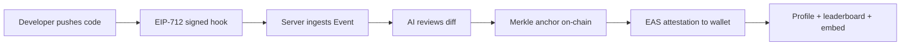

**In one sentence:** Signet watches signed git pushes, grades them, anchors them, attests them on EAS, and surfaces portable rep anywhere.

---

## 3. System architecture

### 3.1 High-level components

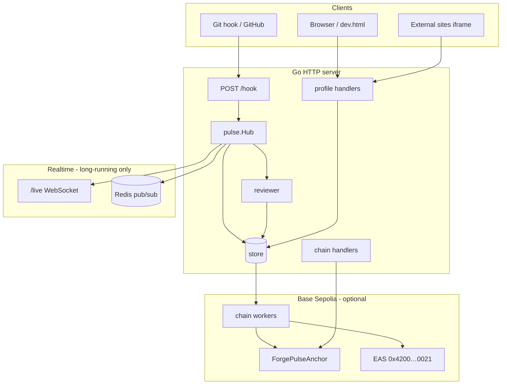

### 3.2 Request routing

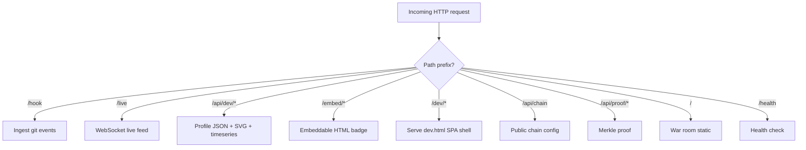

**Entry points:**

| File | Role |
|------|------|
| `cmd/server/main.go` | Long-running server (local, Docker, Railway) |
| `api/index.go` | Vercel serverless entry → `internal/server.Handler()` |
| `internal/server/server.go` | Shared mux setup for both modes |

### 3.3 Data model

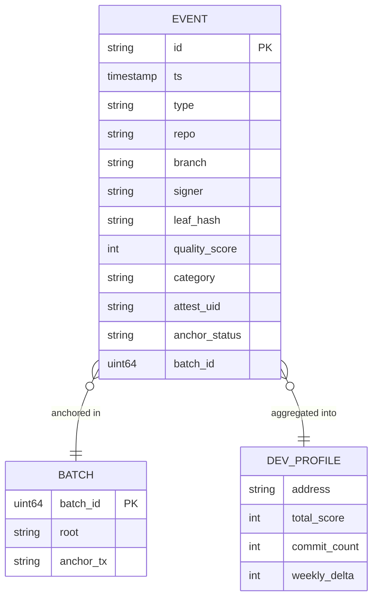

Core struct: `internal/domain/event.go` — all packages import or alias this type.

---

## 4. End-to-end sequence

### 4.1 Push → attestation (full path)

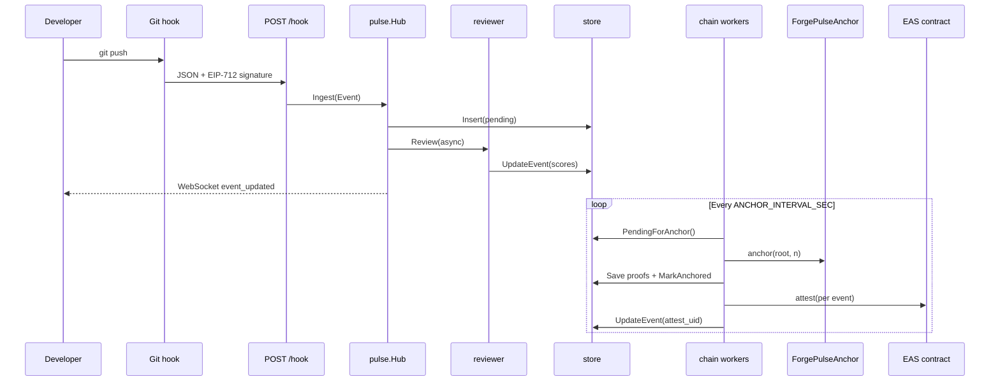

### 4.2 Profile read path

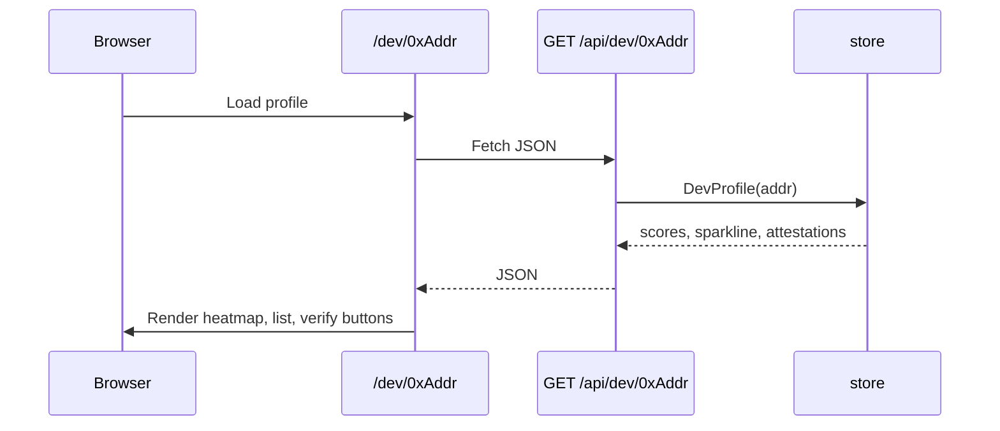

---

## 5. Repository map

```
signet/
├── cmd/
│   ├── server/main.go      # Long-running HTTP server
│   └── verify/main.go      # Self-check harness (score /10)
├── api/
│   └── index.go              # Vercel serverless Handler
├── internal/
│   ├── domain/event.go       # Canonical Event struct
│   ├── pulse/                # Ingest, hub, WebSocket, EIP-712, leaf hash
│   ├── reviewer/             # OpenAI + heuristic AI review
│   ├── store/                # Memory + Postgres, aggregations
│   ├── profile/              # Dev API, embed, SVG badges
│   ├── chain/                # RPC client, Merkle, EAS, workers
│   ├── server/               # Shared mux for Vercel + server
│   ├── relay/                # Optional Redis pub/sub
│   ├── ws/                   # Chat WebSocket (legacy)
│   └── stillroom/            # Meditation app (legacy)
├── contracts/
│   ├── src/ForgePulseAnchor.sol
│   ├── src/ContribSBT.sol
│   └── script/
│       ├── Deploy.s.sol
│       └── RegisterSchema.s.sol
├── static/
│   ├── dev.html              # Signet UI (home, leaderboard, profile)
│   ├── index.html            # War room
│   ├── logo.svg, favicon.svg
│   └── zendo.html
├── scripts/
│   ├── sign-push.mjs         # EIP-712 signing CLI
│   └── post-receive          # Git hook sender
├── vercel.json               # Serverless rewrites + seed env
├── README.md
├── DEMO.md
├── JOURNAL.md
└── SIGNET_GUIDE.md           # This file
```

---

## 6. Code walkthrough

### 6.1 Ingest layer — `internal/pulse/`

#### `handler.go` — `POST /hook`

```go
// Pseudologic from HandleHook:
if X-GitHub-Event header present → ReadGitHubHook(r, HOOK_SECRET)
else → VerifyNativeAuth(Bearer HOOK_TOKEN) → ParseNativeHook(r)
for each event → compute LeafHash if missing → hub.Ingest(event)
return { ok: true, count: N }
```

**Why two paths:** GitHub sends HMAC-signed webhooks; self-hosted git uses a bearer token + JSON body from `post-receive`.

#### `native.go` — Native JSON payload

Parses:

```json
{
  "repo": "org/repo",
  "ref": "refs/heads/main",
  "old_sha": "abc...",
  "new_sha": "def...",
  "pusher": "alice",
  "signer": "0x...",
  "signature": "0x...",
  "commits_detail": [{ "sha": "...", "message": "..." }]
}
```

- `old_sha` all zeros → `branch_create` (not `push`) — AI reviewer only runs on `IsPushLike()` types.
- Calls `VerifyPushSignature` before accepting.
- Computes `EventLeafHash` immediately.

#### `sign.go` — EIP-712 verification

Typed data domain:

| Field | Value |
|-------|-------|
| name | `ForgePulse` |
| version | `1` |
| chainId | `84532` (Base Sepolia) or `CHAIN_ID` env |
| verifyingContract | `ANCHOR_ADDR` |

Primary type `PushEvent`: `repo`, `ref`, `oldSha`, `newSha`, `nonce`, `chainTimestamp`.

`scripts/sign-push.mjs` signs the **same** structure with ethers.js so hook + verifier stay in sync.

#### `leaf.go` — Merkle leaf

```go
// Canonical JSON → keccak256 → 0x-prefixed hex
EventLeafHash(e) = keccak256({ id, repo, ref, old_sha, new_sha, pusher, signer, type, ts_unix })
```

Same leaf is used for: Merkle tree, SBT minting, proof API.

#### `hub.go` — Event bus

| Channel / method | Purpose |
|------------------|---------|
| `Ingest(event)` | Queue event on `ingest` channel |
| `processIngest` | Store, publish, broadcast, trigger review |
| `runReview` | Async: AI → `UpdateEvent` → `event_updated` WS |
| `RecentEvents()` | API reads from store (or memory cache) |
| `ServeLive` | WebSocket upgrade for live feed |

**Branch war** (`war.go`): if two different pushers hit the same branch within 60s, emits a `branch_war` event (war-room feature).

---

### 6.2 AI reviewer — `internal/reviewer/`

#### `reviewer.go`

```go
func New(openAIKey string) Reviewer {
  if openAIKey != "" { return &openAI{...} }
  return &heuristic{}
}
```

#### `openai.go`

- Model: `gpt-4o-mini`
- Forces JSON: `{ score, summary, security[], adds_tests, category }`
- Validates `category` against allowed set; falls back to `inferCategory()` from heuristic.

#### `heuristic.go`

- Runs `git diff old..new` in repo directory (truncated to 8KB)
- Scores by line count, test/fix keywords, security pattern penalties
- Categories from commit message + diff keywords

**Output lands on Event:**

```go
event.QualityScore   = rev.Score
event.QualitySummary = rev.Summary
event.SecurityFlags  = rev.Security
event.Category       = rev.Category
```

---

### 6.3 Storage — `internal/store/`

#### `store.go` — Interface

Key methods:

| Method | Used by |
|--------|---------|
| `Insert` / `UpdateEvent` | Hub, workers |
| `PendingForAnchor` | Anchor batcher |
| `MarkAnchored` / `SaveBatchRoot` | After anchor tx |
| `GetProof` | `/api/proof/:id` |
| `DevProfile` | Profile API |
| `Leaderboard` | Leaderboard API |
| `Timeseries` / `CategoryMix` / `WeeklyDelta` / `RecentAttested` | Dense UI |

#### `memory.go` vs `postgres.go`

- **Memory:** in-process slice, max ~500 events — default for `go run` and Vercel.
- **Postgres:** full schema in `migrate()`, JSON `payload` column holds full `Event` including `attest_uid`, `quality_score`, etc.

`OpenFromEnv()` in `postgres.go`: if `DATABASE_URL` set → Postgres, else Memory.

#### `profile.go` + `aggregations.go`

- **`isAttested(e)`** — `attest_uid != ""`
- **`buildDevProfile`** — filter attested events for address, sum scores, top repos
- **`buildLeaderboardEnriched`** — rank all signers + weekly delta + category mix per row
- **`buildTimeseries`** — 30 day buckets, fill missing days with zero

#### `seed.go` — Demo data

When `SIGNET_DEV_SEED=1` or `VERCEL=1`:

- Inserts 15 fake attested events across 3 wallets
- Powers leaderboard + profile UI without real git or chain

---

### 6.4 Chain layer — `internal/chain/`

#### `client.go`

Wraps `ethclient` + relayer private key. Exposes:

- `AnchorRoot(root, leaves)` → tx hash
- `BatchCount()` → for batch ID
- `VerifyOnChain(batchId, leaf, proof)` → view call
- `MintSBTBatch(devs, hashes)` → optional SBT
- EAS via `eas.go`

Disabled when `RPC_URL`, `RELAYER_PRIVATE_KEY`, or `ANCHOR_ADDR` missing.

#### `merkle.go`

- Sorts leaf hashes
- Builds binary Merkle tree (sorted pairs, `keccak256(abi.encodePacked)` style)
- Returns root hex + `map[leaf]proof[]`

#### `workers.go` — Background jobs

**Anchor batcher** (default every 60s):

1. `PendingForAnchor(256)`
2. `BuildMerkleTree(leaves)`
3. `cli.AnchorRoot(root, count)`
4. Save batch root + proofs + `MarkAnchored`
5. For each event with signer: **`cli.Attest(event)`** → store `attest_uid`
6. Queue SBT mint items

**SBT minter** (default every 300s): batches pending SBT queue into `mintBatch`.

#### `eas.go` — EAS attestations

- Uses canonical Base Sepolia EAS: `0x4200000000000000000000000000000000000021`
- Schema registry: `0x4200000000000000000000000000000000000020`
- Schema string registered once via `RegisterSchema.s.sol`
- Encodes attestation data: commit hash, leaf, repo, branch, score, summary, flags, category
- Recipient = `event.Signer`

#### `handlers.go`

| Handler | Route |
|---------|-------|
| `HandleChainConfig` | `GET /api/chain` — addresses, schema UID, explorers |
| `HandleProof` | `GET /api/proof/:eventId` |
| `HandleBounties` / `HandleBountyClaim` | Legacy bounty API |
| `HandleSBTLookup` | `GET /api/sbt/:addr` |

---

### 6.5 Profile layer — `internal/profile/`

#### `handler.go`

Routes under `/api/dev/`:

| Suffix | Handler |
|--------|---------|
| `leaderboard` | Top 50 enriched entries |
| `recent` | Latest attestations (ticker) |
| `{addr}` | Full `DevProfile` JSON |
| `{addr}/badge.svg` | Small SVG |
| `{addr}/og.svg` | 1200×630 OG card |
| `{addr}/timeseries` | Day buckets |

#### `svg.go`

Server-rendered SVG (no headless browser):

- `renderBadgeSVG` — 320×80 “Signet Verified”
- `renderOGSVG` — full share card with stats + top repos
- `sparklineBars` — 7-day mini bars for detailed embed

#### `embed.go`

HTML iframe variants:

| Query `?v=` | Size | Contents |
|-------------|------|----------|
| `compact` | 200×60 | Sigil + addr + rep |
| `standard` | 320×80 | Default badge |
| `detailed` | 440×140 | + sparkline + top repo |

Gradient avatar from address bytes; optional ENS via `api.ensideas.com`.

---

### 6.6 Shared server — `internal/server/server.go`

Used by **both** `cmd/server` and Vercel `api/index.go`:

```go
var once sync.Once
func Handler() http.Handler {
  once.Do(func() { handler = newMux() })
  return handler
}
```

**Vercel-specific behavior:**

| Condition | Behavior |
|-----------|----------|
| `VERCEL=1` | Seed demo data, disable chain workers, `/live` returns 501 |
| `SIGNET_DEV_SEED=1` | Seed demo data |

---

### 6.7 Verification — `cmd/verify/main.go`

Automated rubric (max 10.0):

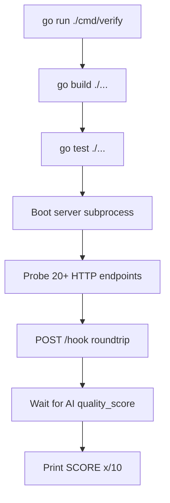

---

## 7. Smart contracts

### 7.1 `ForgePulseAnchor.sol`

```solidity
function anchor(bytes32 root, uint32 leaves) external;  // relayer only
function verify(uint256 batchId, bytes32 leaf, bytes32[] proof) view returns (bool);
```

**Purpose:** Cheap batch proof-of-existence for many git events in one transaction.

### 7.2 `ContribSBT.sol`

Soulbound-style contributor token (optional). Minted in batches by relayer after anchor.

### 7.3 EAS schema — `RegisterSchema.s.sol`

One-time script:

```
bytes32 commitHash, bytes32 leafHash, string repo, string branch,
uint16 qualityScore, string aiSummary, string[] securityFlags, string category
```

Output: `EAS_SCHEMA_UID` → paste in `.env`.

### 7.4 Deploy — `Deploy.s.sol`

Deploys `ForgePulseAnchor` + `ContribSBT`, logs addresses for `.env`.

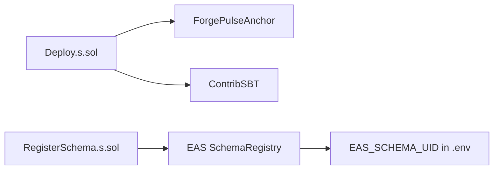

---

## 8. Frontend & API

### 8.1 `static/dev.html`

Single-page app (vanilla JS) with three views:

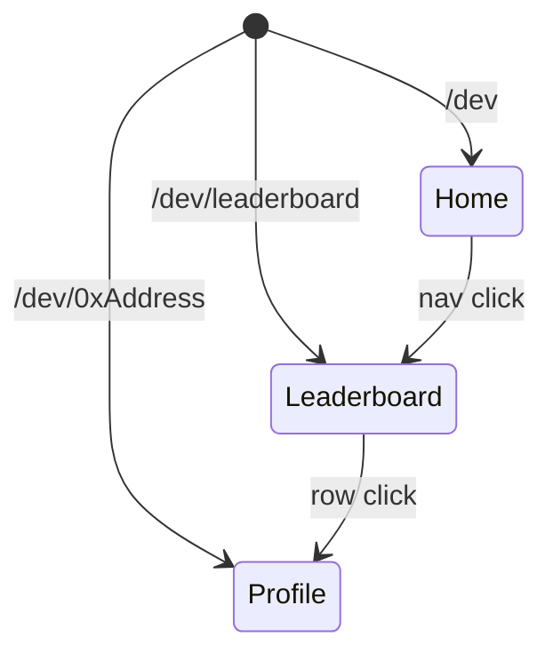

**Profile sections:**

1. Hero — avatar gradient, ENS, stats (rep, commits, 7d Δ, security flags)
2. 30-day heatmap — opacity = score
3. Sparkline — SVG polyline from `sparkline[]`
4. Repo bars — top 5 by score
5. Category mix — stacked horizontal bar
6. Attestation list — filters + “Verify on-chain” (eth_call to EAS)
7. Embed copy buttons — compact / standard / detailed iframes

**Live updates:** WebSocket `/live` on profile; home ticker uses `/api/dev/recent` + WS prepend.

### 8.2 `static/index.html` — War room

Legacy real-time git ops UI. Links to Signet at `/dev`.

### 8.3 Public API summary

| Method | Path | Response |
|--------|------|----------|
| GET | `/health` | `{ "status": "ok" }` |
| POST | `/hook` | Ingest events |
| GET | `/api/events` | Recent events from hub |
| GET | `/api/chain` | Chain + EAS config |
| GET | `/api/dev/leaderboard` | Ranked devs |
| GET | `/api/dev/recent` | Latest attestations |
| GET | `/api/dev/{addr}` | Full profile |
| GET | `/api/dev/{addr}/timeseries` | Day buckets |
| GET | `/api/dev/{addr}/badge.svg` | SVG |
| GET | `/api/dev/{addr}/og.svg` | OG SVG |
| GET | `/embed/{addr}?v=` | HTML embed |
| GET | `/api/proof/{id}` | Merkle proof |

---

## 9. Storage & aggregations

### Attestation gate

Only events with **`attest_uid`** count toward reputation. That means:

1. Event was anchored (has `leaf_hash`, `batch_id`)
2. EAS attestation succeeded (has `attest_uid`)

UI “SIGNET VERIFIED” chip = at least one attested commit on profile.

### Weekly delta

Sum of `quality_score` for attested events in the **last 7 days** for that address.

### Category mix

Count of events per `category` for leaderboard mini-bars and profile stacked bar.

---

## 10. Deployment modes

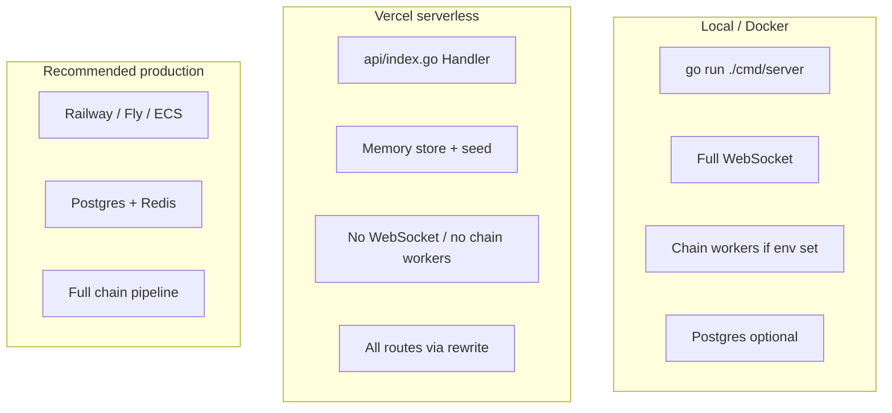

| Feature | Local | Vercel | Production host |
|---------|-------|--------|-----------------|
| REST API | ✅ | ✅ | ✅ |
| Demo seed | `SIGNET_DEV_SEED=1` | Auto | Optional |
| WebSocket `/live` | ✅ | ❌ (501) | ✅ |
| EAS attestations | ✅ if RPC | ❌ | ✅ |
| Persistent DB | Optional | ❌ | ✅ Postgres |

**Vercel project name:** use `signet-proof-of-code` (plain `signet` may conflict on your account).

---

## 11. Environment variables

| Variable | Required | Description |
|----------|----------|-------------|
| `PORT` | No | HTTP port (default `8080`) |
| `OPENAI_API_KEY` | No | Enables OpenAI reviewer |
| `DATABASE_URL` | No | Postgres; else memory |
| `REDIS_URL` | No | Multi-instance pub/sub |
| `HOOK_TOKEN` | No | Bearer for native `/hook` |
| `GITHUB_WEBHOOK_SECRET` | No | GitHub HMAC |
| `RPC_URL` | For chain | Base Sepolia RPC |
| `RELAYER_PRIVATE_KEY` | For chain | Signs anchor + EAS txs |
| `ANCHOR_ADDR` | For chain | Deployed ForgePulseAnchor |
| `EAS_SCHEMA_UID` | For EAS | From RegisterSchema script |
| `EAS_ADDR` | No | Default canonical on Base |
| `ANCHOR_INTERVAL_SEC` | No | Default `60` |
| `SIGNET_DEV_SEED` | No | Inject demo events |
| `VERCEL` | Auto on Vercel | Seed + disable workers |
| `FORGEPULSE_PRIVATE_KEY` | For signing | `sign-push.mjs` CLI |

---

## 12. How to run

### Quick demo (no chain)

```bash
git clone https://github.com/chaitu0608/signet.git
cd signet
go mod tidy
SIGNET_DEV_SEED=1 go run ./cmd/server
```

Open:

- http://localhost:8080/dev
- http://localhost:8080/dev/leaderboard
- http://localhost:8080/dev/0xabc0000000000000000000000000000000000001

### Verify everything

```bash
go run ./cmd/verify
# Expected: SCORE: 10.0 / 10
```

### Full on-chain setup

```bash
cd contracts
forge script script/Deploy.s.sol --rpc-url $BASE_SEPOLIA_RPC --broadcast
forge script script/RegisterSchema.s.sol --rpc-url $BASE_SEPOLIA_RPC --broadcast
# Copy ANCHOR_ADDR, EAS_SCHEMA_UID to .env
```

### Sign a real push

```bash
cd scripts && npm install
export FORGEPULSE_PRIVATE_KEY=0x...
node sign-push.mjs /path/to/repo refs/heads/main <old_sha> <new_sha>
# Wire post-receive to POST to your server's /hook
```

### Deploy to Vercel

https://vercel.com/new/clone?repository-url=https%3A%2F%2Fgithub.com%2Fchaitu0608%2Fsignet&project-name=signet-proof-of-code

---

## 13. Verification harness

The harness in `cmd/verify/main.go` is the **source of truth** for “does the demo path work?”

| Check | Weight | What it proves |
|-------|--------|----------------|
| `go.build` | 1.5 | Entire module compiles |
| `go.test` | 1.0 | Unit tests pass |
| `health` | 0.5 | Server boots |
| `hook.roundtrip` | 1.0 | Ingest → visible in `/api/events` |
| `ai.scoring` | 0.5 | Async reviewer writes `quality_score` |
| Profile/leaderboard/embed/OG | 0.5 each | Signet UI surfaces work |

---

## 14. What to do with Signet

Signet is not just a hackathon repo — it is a **credential layer** you can use in several ways:

### 14.1 As a portfolio piece

- Link live Vercel URL + GitHub in resume/LinkedIn
- Embed badge on personal site:
  ```html
  <iframe src="https://YOUR-DEPLOY/embed/0xYourWallet?v=standard"
          width="320" height="80" style="border:none" title="Signet"></iframe>
  ```
- Point judges to `/dev/0xYou` and an EAS explorer link

### 14.2 As a grant / DAO primitive

- DAOs filter contributors by **attested rep score** instead of GitHub stars
- Retro funding weights `quality_score` × commits in a time window
- Public leaderboard = transparent merit signal

### 14.3 As hiring infrastructure

- Recruiter API: `GET /api/dev/{addr}` → structured commit history + AI summaries
- “Verify on-chain” button proves attestation was issued on Base, not forged in UI

### 14.4 As a git hook product

- Ship `sign-push.mjs` + `post-receive` as installable CLI (`npx signet-hook init`)
- Teams opt-in: every merge to `main` → attested rep for contributors

### 14.5 As an EAS ecosystem app

- Register schema on mainnet Base
- List on EAS Explorer / attestation indexes
- Partner with wallets to show “Signet rep” in address profiles

---

## 15. Where to move forward

### Phase 1 — Make it production-real (2–4 weeks)

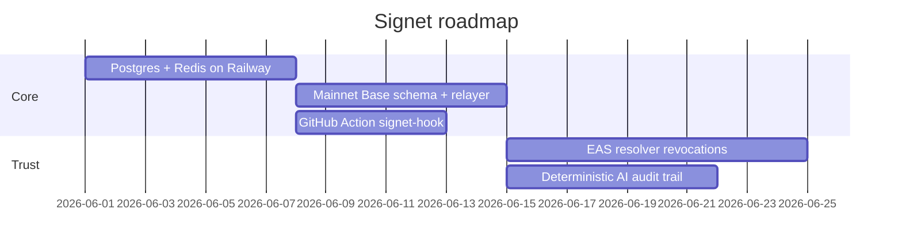

| Priority | Task | Why |
|----------|------|-----|
| 🔴 P0 | Host on **Railway/Fly** (not Vercel) for full WS + chain | Vercel is demo-only |
| 🔴 P0 | **GitHub Action** `signet-attest@v1` | Zero-friction adoption |
| 🟠 P1 | **EAS resolver** — revoke if commit reverted | Adversarial resistance |
| 🟠 P1 | **Mainnet Base** schema + funded relayer | Real credentials |
| 🟡 P2 | ENS reverse cache server-side | Better leaderboard UX |

### Phase 2 — Product surface (1–2 months)

- **Repo-level rep** — aggregate all contributors to `org/repo`
- **Historical import** — backfill GitHub commits as attestations (cold start fix)
- **Hiring API** — paid tier for recruiters
- **PNG OG export** — Twitter cards without SVG limitations
- **Anti-gaming** — sock-puppet detection, cross-account diff overlap

### Phase 3 — Ecosystem (3+ months)

- Wallet integrations (Rainbow, Coinbase Wallet show Signet score)
- **Quadratic funding** tie-in (shelved `RepoTreasury` concept, rebuilt on EAS)
- **Cross-chain** — same schema on Optimism / Arbitrum, aggregate profile
- **Self-hosted reviewer** — remove OpenAI dependency; post model hash on-chain

### What NOT to build (lessons from v4 scope cut)

| Cut | Reason |
|-----|--------|
| Farcaster frames | Distraction from rep loop |
| CCTP / multi-chain USDC | Not rep |
| Paymaster / AA | Infrastructure rabbit hole |
| Custom attest contract | EAS is the standard |
| 10 features at once | Judges remember one loop |

### Success metrics

| Metric | Target |
|--------|--------|
| Attestations / week | 100+ real (not seed) |
| Unique signer wallets | 50+ |
| Embed installs | 20+ READMEs |
| EAS schema usage | Listed + indexed |

### One-line north star

> **Become the default portable rep layer for open-source developers — the EAS equivalent of “GitHub contribution graph,” but owned by the developer’s wallet.**

---

## Appendix A — Shelved / legacy code

Still in repo but **not** on the MVP demo path:

- `static/index.html` — War room
- `internal/ws` — Chat
- `internal/stillroom` — Zendo meditation
- `/api/bounties`, SBT minter (secondary to EAS story)
- `/web3` → redirects to `/dev/leaderboard`

---

## Appendix B — File → responsibility quick reference

| File | One-line responsibility |
|------|-------------------------|
| `domain/event.go` | Canonical event shape |
| `pulse/handler.go` | HTTP ingest |
| `pulse/hub.go` | Event loop + review trigger |
| `pulse/sign.go` | EIP-712 verify |
| `pulse/leaf.go` | Merkle leaf hash |
| `reviewer/*.go` | AI scoring |
| `store/*.go` | Persistence + aggregates |
| `chain/workers.go` | Anchor + EAS batch |
| `chain/eas.go` | EAS encode + attest |
| `profile/*.go` | Public rep API + embeds |
| `static/dev.html` | Signet UI |
| `cmd/verify/main.go` | Health score |
| `api/index.go` | Vercel entry |

---

*Last updated: May 2026 — matches `main` branch at https://github.com/chaitu0608/signet*
